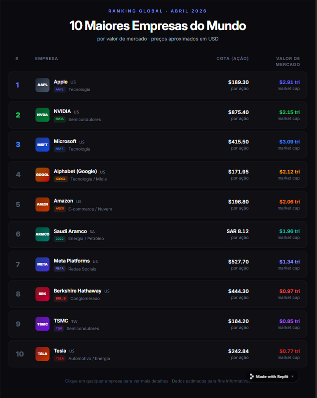

# maiores-empresas-mundo
Projeto pra treinar git e github, request e streamlit

##obejtivo chegar em um projeto semelhante a foto abaixo

## 02/04/2026: analisar melhor a api de logo, se dar pra colocar alguma variavel pra buscar o nome certo da empresa, caso nao ache uma solucao criar uma caixinha com o nome do tokem, exp: NVDS - AAPL - GOOGL - FEITO: foi feito um de/para dos nomes que vem para os nomes esperados 

### verificar o filtro das empresas pq tem essa saudin arabian que creio q nao seri uma empresa valida de estar no ranking - FEITO: como arrumeir o caso acima o filtro de empresa pode ser adicionado qualquer empresa, caso nao ache o logo da empresa em questao no top 10, basta colocar ela no filtro do de/para

### 03/04/2026: identifiquei que a API do yfinance nem sabre traz o valor em USD, vou ter que converter todos os valores que nao vem em USD para USD e isso muda o ranking 

a logica vai ser pegar a moeda que a api esta trazendo exp SAR se for diferente de dolar tem que achar ela na lista e na lista fazer um de para 

#### formatar o valor de mercado e valor de cota

# feat: 1° Realizada ajustes de um de -> para nos nomes da empresa para organizar na api de logo - 2° Feita a função para pegar os valores e formatar em Tri, Bi e Mi - 3° Identifiquei que a API do Yfinance nao traz como padrao os valores em USD, tenho que converter esses valores com a api que esta no arquvio teste_coin